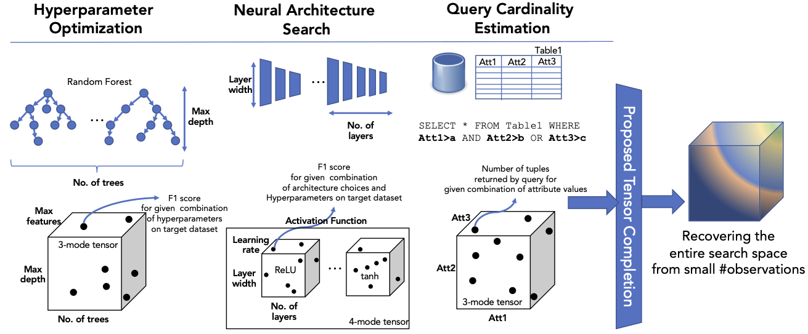
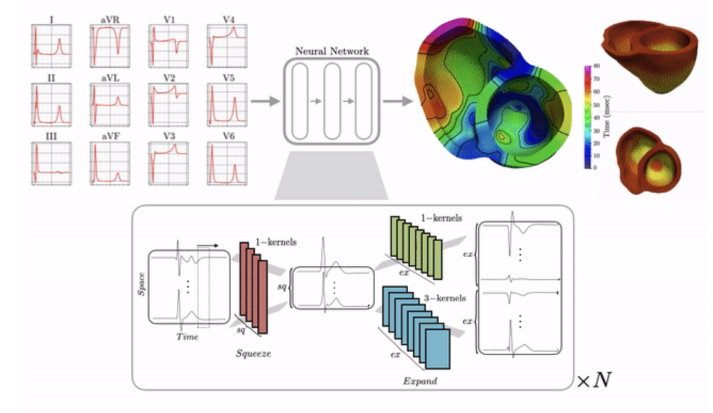
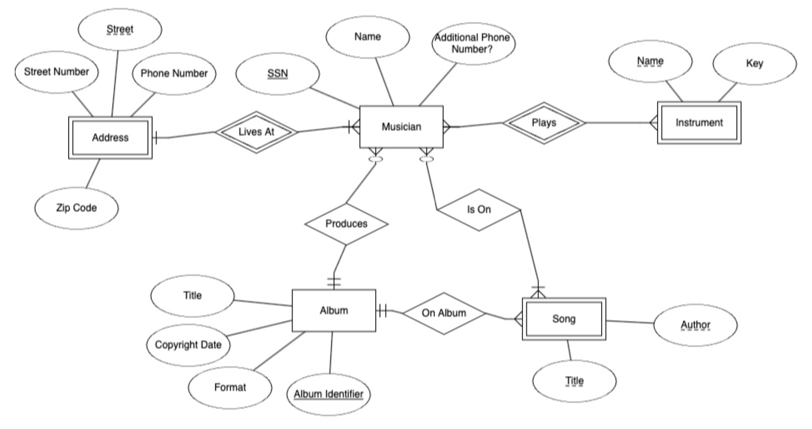
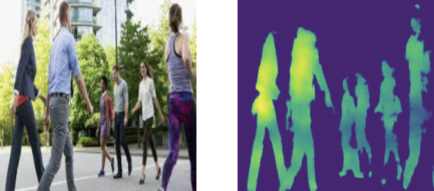
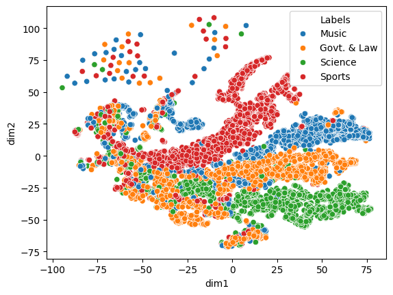
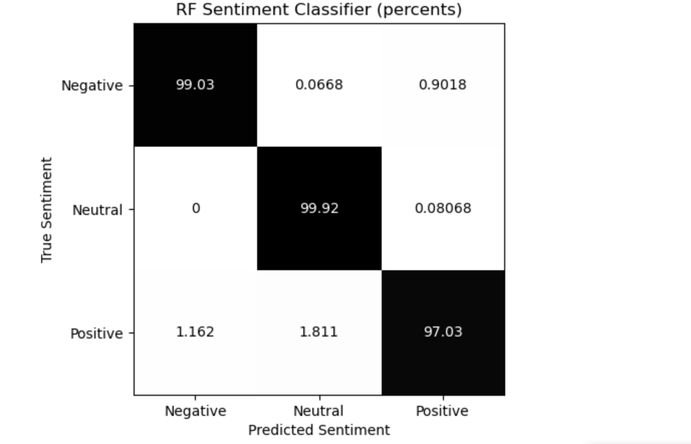

  Hello! My name is Shaan Pakala. I am a fourth year <a href="https://datascience.ucr.edu/">Data Science & Engineering</a> (B.S.) student at the University of California, Riverside. During my time here, I have been a <a href="https://www.nsf.gov/awardsearch/showAward?AWD_ID=2244480&HistoricalAwards=false">NSF REU</a> data science research intern with Professors <a href="https://www.cs.ucr.edu/~epapalex/">Vagelis Papalexakis</a>, <a href="https://sites.google.com/view/jiachen-research/home">Jia Chen</a>, & <a href="https://www.cs.ucr.edu/~tsotras/">Vassilis Tsotras</a>, as well as a participant in the Lawrence Livermore National Laboratory <a href="https://www.llnl.gov/article/50051/uc-merced-uc-riverside-tackle-data-science-challenge-machine-learning-assisted-heart">2023 Data Science Challenge</a>. Currently, I am working as a Bioinformatics Research Assistant with Professor <a href="https://www.cs.ucr.edu/~stelo/">Stefano Lonardi</a>.

 

<b>Education</b>

  <b>Data Science & Engineering, B.S.</b>
  September 2021 - June 2025

<em>University of California, Riverside</em>

 

<b>Experience</b>

  <b>Bioinformatics Research Assistant</b>
  March 2024 - Present

<em>University of California, Riverside</em>

  <b><a href="https://www.nsf.gov/awardsearch/showAward?AWD_ID=2244480&HistoricalAwards=false">NSF REU</a> Data Science Research Intern</b>
  Summer 2024

<em>University of California, Riverside</em>

  <b>Data Science Fellow</b>
  Summer 2023

<em>Lawrence Livermore National Laboratory</em>

  <b>Data Science Summer Camp Mentor</b>
  Summer 2022

<em>Spotline, Inc.</em>

 

<b>Projects</b> <i>(click image for GitHub)</i>

<b><u>Automating Data Science Pipelines with Tensor Completion</u></b>

Submitted paper as first author to <a href="https://www3.cs.stonybrook.edu/~ieeebigdata2024/" target="_blank">IEEE Big Data 2024</a> (under review). This project was funded by the <a href="https://www.nsf.gov/awardsearch/showAward?AWD_ID=2244480&HistoricalAwards=false">NSF REU</a> program during Summer 2024. Here I worked under UC Riverside Professors, in collaboration with Ph.D. & B.S. students, to research automatic and efficient hyperparameter optimization using <a href="https://www.columbia.edu/~my2550/talks/tensortalk2.pdf">tensor completion</a> algorithms.

  

<b><u>Solving Problems in Cardiology with Machine Learning</u></b>

At the Lawrence Livermore National Laboratory <a href="https://www.llnl.gov/article/50051/uc-merced-uc-riverside-tackle-data-science-challenge-machine-learning-assisted-heart">2023 Data Science Challenge</a>, I worked in a team to develop data driven solutions to problems in cardiology. This included automated heart disease classification, as well as a 3D reconstruction of human heart activity over 500ms, using solely non-invasive electrocardiogram data.

  

<b><u>Simulated Online Store Database</u></b>

Final Project for Database Management Systems (CS166 at UC Riverside). Here I worked in a team of 2 to implement a relational database for a simulated online store (e.g. Amazon online store), using PostgreSQL & Java for UI. This included 5 tables, as well as implementing triggers and indexes for improved efficiency. Customer, manager, and admin functions were included to mimic a real online store experience.

  

<b><u>Image Segmentation</u></b>

Some image segmentation projects I have worked on, mainly to familiarize myself with modern computer vision techniques. Overall, I learned how to develop a <a href="https://en.wikipedia.org/wiki/U-Net" target="_blank">U-Net</a> architecture with skip connections using PyTorch. I also learned some image processing techniques using OpenCV.

  

<b><u>Wikipedia Article Visualization & Classification</u></b>

Webscraped Wikipedia articles of several categories, and then converted them to hidden states using Google's <a href="https://en.wikipedia.org/wiki/BERT_(language_model)" target="_blank">BERT</a>. From here, I compressed each text input's 2D hidden state to a vector of size 2 for a scatter plot visualization. This highlighted the different in articles of different categories, and the similaries of those in the same category. From here, topic classification was relatively trivial.

 

<b><u>Online Reviews Sentiment Analysis</u></b>

Started as a final project for Data Analysis Methods (CS105 at UC Riverside), but I got carried away and extended it. I webscraped online reviews (from <a href="https://www.yelp.com/" target="_blank">yelp</a> & <a href="https://www.yellowpages.com/" target="_blank">yp</a>) to build a machine learning model (random forest) to classify online reviews' sentiment. The bulk of the work was preprocessing the text, as well as text vectorization in a way that makes it easy for the machine learning model to classify.

 

<i>Last updated September 16, 2024</i>

